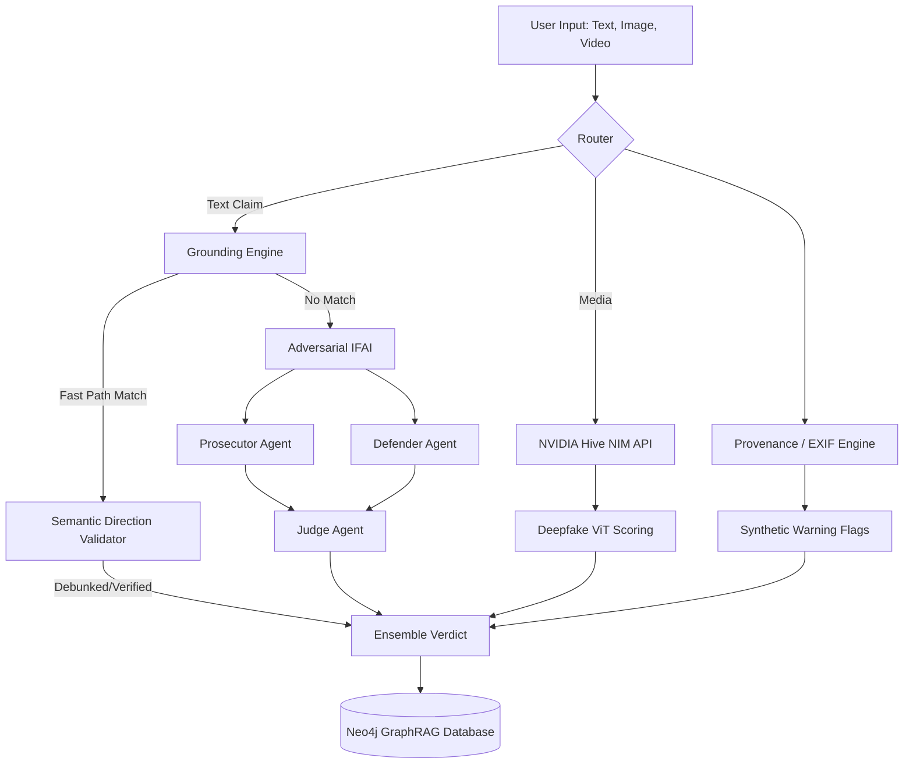

# 🔍 Agentic-Truth: Multi-Modal Misinformation Detection

[](https://python.org)
[](https://fastapi.tiangolo.com)
[](https://react.dev)
[](https://neo4j.com)
[](https://groq.com)
[](https://build.nvidia.com/)

> A production-grade AI system that detects misinformation across text, images, and videos using an **Agentic Forensic Architecture (IFAI)**, **GraphRAG Memory**, and **NVIDIA Vision Transformers**.

---

## 🎯 Elite V2 Architecture Overview

Traditional fact-checkers rely on simple keyword matching or black-box LLM hallucinations. **Agentic-Truth** utilizes an adversarial Multi-Agent architecture to debate claims in real-time, backed by hard cryptographic and semantic provenance data.

### 1. IFAI Text Forensic Pipeline
- **Grounding Engine (Fast Path):** Synchronizes with the Google Fact Check API. Uses a precise LLM Semantic Direction Validator to prevent false positives (e.g., distinguishing between a claim and the *debunking* of a claim).
- **Prosecutor & Defender Agents:** Native `asyncio` parallel orchestration (zero LangChain overhead). Agents autonomously scrape the web (via Tavily/SerpAPI) to build opposing cases.
- **The Judge Agent:** A powerful Llama-3.1 model running on Groq evaluates the evidence and issues a 3-part rationale (Style, Content, Cross-Source Consistency) with an explicit confidence score.

### 2. Multi-Modal Deepfake Detection
- **NVIDIA Hive NIM ViT:** Processes images and videos using state-of-the-art Vision Transformers to detect face-swaps and pixel manipulation.
- **Provenance Metadata Engine:** Analyzes EXIF camera data. Automatically flags 100% synthetic diffusion images (e.g., Midjourney/DALL-E) that bypass traditional face-swap detectors.
- **Audio-Visual Sync:** Video forensics pipeline extracts audio, runs transcription, and cross-references visual speech patterns against known physical constraints.

### 3. GraphRAG Memory System
- **Neo4j Knowledge Graph:** Persistently stores entities, claims, and URLs across sessions.
- **Cross-Claim Corroboration:** Instantly identifies if a newly submitted claim contradicts a previously verified claim in the graph, preventing the AI from repeating research.

---

## 🏗️ System Architecture Flow



---

## 🛠️ Tech Stack

| Component | Technology |
|-----------|-----------|
| **Frontend** | React, Vite, Lucide Icons, Vanilla CSS |
| **Backend API** | FastAPI, Uvicorn, Python 3.12 |
| **Agentic AI** | Groq API (Llama-3.1-8b-instant), Native Asyncio |
| **Computer Vision** | NVIDIA Hive NIM, OpenCV, PyTesseract |
| **Graph Database** | Neo4j, Cypher |
| **Web Scraping** | Tavily API, SerpAPI, BeautifulSoup4 |

---

## 🚀 Quick Start

### 1. Backend Setup
```bash
# Clone and enter directory
git clone https://github.com/KolaganiMuraliManohar/Agentic-Truth.git
cd Agentic-Truth

# Create virtual environment
python -m venv venv
venv\Scripts\activate        # Windows
# source venv/bin/activate   # Linux/Mac

# Install dependencies
pip install -r requirements.txt

# Configure API Keys
cp .env.example .env
# Edit .env with your Groq, Neo4j, NVIDIA, and Tavily keys

# Run the API
uvicorn src.api.main:app --host 127.0.0.1 --port 8000
```

### 2. Frontend Setup
```bash
# Open a new terminal
cd frontend

# Install Node modules
npm install

# Start the Vite development server
npm run dev
```

The UI will be accessible at `http://localhost:5173`.

---

## 📊 Performance & Limits

- **Text Latency:** ~2-4 seconds (Fast Path), ~8-15 seconds (Full Multi-Agent Debate).
- **Vision Limitations:** System reliably detects face-swaps via NVIDIA Hive. Fully synthetic diffusion images trigger an "Uncertain" metadata warning flag rather than a definitive "Fake" score, due to current generation ViT limitations.

---
*Built by Murali Manohar Kolagani as an advanced exploration into Agentic AI and Digital Forensics.*
